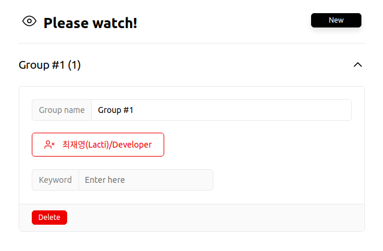

# Please watch Jira

Chrome extension to add issue watchers easily.

## Installation

1. Download latest `please-watch-jira.zip` from [releases](/releases).
2. Unpack it.
3. Turn on `Developer mode` from [`chrome://extensions`](chrome://extensions) in your chrome browser.
   
   
4. Use `Load unpacked` and select the unpacked directory.
   
5. Pin this extension from _Manage extensions_.
   

## Usage

1. Setup groups from settings popup.
   Please use this popup only on `atlassian page` such as _Jira_ because it uses Atlassian API in your credentials.
   
   You can add a new group using `New` button.
   
2. Input a name and project key. You can find your project key in your atlassian URL.
   
3. And then, you can search watchers using `Keyword input`. All things are valid, you can see new members when you press enter key from `Keyword input`. If you want to delete a member, just click it.
   
4. After finished, click the icon of this extension to close this settings popup.
5. Open Jira issue or Servicedesk page, add watchers using context menu.
   

## Update plugins

1. Download new version from [releases](/releases) and overwrite old things.
2. Go to [`chrome://extensions`](chrome://extensions) and click _Refresh_ button.
   

## License

MIT
